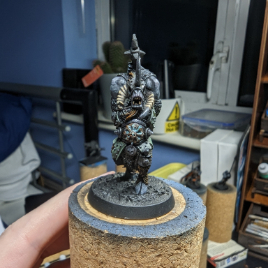

# Emperor's Champion

## Paints

- SP, 70.602: Black
- SP, 70.607: UK Bronze Green
- GC, 72.027: Scurvy Green
- Metal Colour, 77.723: Exhaust Manifold
- MA, 71.275: USAF Medium grey
- MA, 71.304: ATM-11 Blue Grey
- MA, 71.251: Nato Black
- GI, 72.094: Black
- GI, 72.093: Skin Wash
- AP, Purple tone
- MC, 70.838: Emerald
- GC, 72.006: Sun Yellow
- GC, 72.095L Glacier Blue

## Armor

Undercoat with a mix of both 70.602 & 70.607
Base coat with a mix of both 70.602 & Scurvy Green

## Cockpit & Bomber bay

1. After masking off the area base coat with ATM-11 Blue Grey
2. Mix Nato black with ATM-11 Blue Grey to create the shade
3. Use USAF Medium grey on the raised parts for a bit of contrast

## Exhaust

1. Base coat with Exhaust Manifold
2. Mix in some Black to Exhaust Manifold and apply to the end of the exhaust
3. Next, apply some Skin wash and Purple tone to the exhaust in a random manner to create heat discolouration

## Panels

1. Begin by outlining all the panels with Emerald
2. Follow this with a mix of Emerald, Sun Yellow and Glacier Blue
3. For the final highlight use Emerald and Sun Yellow
